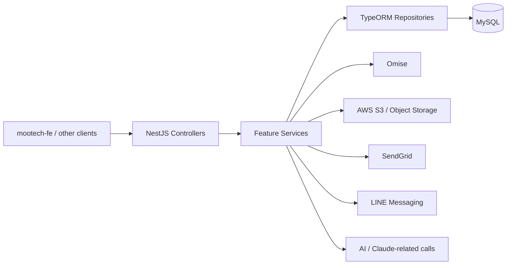
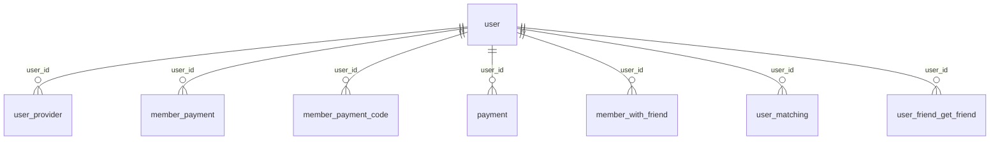

# Project Map: mootech-be

Updated: 2026-06-19
Grounded from: `package.json`, `src/main.ts`, `src/app.module.ts`, `src/config/database/*.ts`, controller inventory, `@Entity()` inventory under `src/**/entity/*.ts`, and the 2026-06-19 production DB migration to Supabase Pro.

## 🔒 Collaboration Contract (Human ↔ AI) — ratified 2026-06-19

ข้อตกลง **บังคับ** สำหรับการทำงานร่วมกันหลังระบบ live. AI ต้องปฏิบัติตามทุกข้อ ห้ามข้าม.

### Branch & Deploy
- **Production branch = `feat/supabase-repoint`** (remote `mootech` → github.com/mojisejr/mootech-be) — Render `srv-d8nc4j8k1i2s73d7e030` autoDeploy on push.
- **ห้าม push ตรงเข้า production branch เด็ดขาด.** ทุกการเปลี่ยนแปลง: `feature branch → PR → operator review → approve → merge`.
- AI **ห้าม** merge PR ของตัวเอง และ **ห้าม** deploy เองโดยไม่ได้รับ approve.
- Deploy ได้เมื่อ: Hard Gate (build/lint/test) เขียว **และ** PR merged **และ** operator OK เท่านั้น.
- Follow-up: ตั้ง GitHub branch protection (require PR, block direct push); พิจารณา rename → `production`.

### Database (ศักดิ์สิทธิ์ — แตะต้องคุยก่อน)
- prod DB = Supabase **Pro `soxsccdlsycaevusndro`** (ap-southeast-1 pooler); dev = `jgxsjhbdhttfoiyvptvy`.
- การแตะ DB ทุกชนิด (schema, migration, data mutation, prod query, backfill, storage) → **คุย + operator approve ก่อนเสมอ.**
- prod-destructive SQL → **operator รันเอง**; AI เสนอ SQL + verify ผ่าน API/read-only (harness gate).
- ห้าม `DB_SYNCHRONIZE=true`, ห้าม drop/truncate prod, ห้าม auto-migration, ห้ามตั้ง `MIGRATION_ENABLED=true` ค้างไว้.

### Ask-First (อะไรเสี่ยง ถามก่อน)
AI ต้องหยุดถาม operator ก่อนทำ: DB schema/data, env/secret changes, deploy/cutover, เปิด-ปิด maintenance, Omise live keys / payment, domain/DNS, Render/Vercel config, force git ops, ลบไฟล์/ข้อมูล, และ irreversible/outward-facing actions ทุกชนิด.

### Hygiene
- commit แนบ issue id (`#...`) + `Co-Authored-By`; PR body ระบุ **risk + rollback**.
- ห้าม commit `.env*` (gitignored); rotate secrets ก่อน live; ห้าม echo secret ออก chat.

## Philosophy

`mootech-be` เป็น NestJS monolith backend ของฝั่ง Mootech เดิม ที่รวมหลาย concern ไว้ในตัวเดียว:

- astrology / Chinese horoscope / Bazi-style calculation
- content lookup และ master-data tables สำหรับการวิเคราะห์
- user/auth/social graph แบบเบา
- payment/subscription/topup flows
- logging, survey, image save, AI, message, callback integrations

จากโครงสร้างที่มีอยู่ โปรเจกต์นี้ไม่ใช่ backend แบบ CRUD ธรรมดา แต่เป็น service layer สำหรับแอปดวงจีน/สมาชิก/การชำระเงินที่สะสม domain knowledge ไว้ใน database จำนวนมาก แล้วให้ service/controller ดึงไปประกอบผลลัพธ์ให้ frontend.

สำหรับทีมปัจจุบัน ควรมอง repo นี้เป็น "legacy backend truth" ของฝั่ง `mootech-fe` มากกว่าเป็น backend ที่ออกแบบใหม่ร่วมกับ `bazi`. งานของ `bazi` มีลักษณะเป็น integration/extension ทับบน surface เดิม ไม่ใช่เจ้าของ domain model ต้นทาง.

## Stack

- Framework: NestJS 9
- ORM: TypeORM 0.3
- Database: **PostgreSQL (Supabase)** — migrated from MySQL 2026-06-19. prod=Pro `soxsccdlsycaevusndro`, dev=`jgxsjhbdhttfoiyvptvy`. Connects by individual params (host/port/user/pass), `synchronize=false`, `ssl.rejectUnauthorized=false`. env swap via `npm run env:prod`/`env:dev`. (Legacy MySQL driver still in deps; runtime is Postgres.)
- Runtime: TypeScript / Node.js (Docker on Render; node19 + `ws` WebSocket polyfill)
- Scheduler: `@nestjs/schedule` (morning LINE crons 06:00/09:00 — guarded for null chinese_calendar)
- Payment integration: Omise — **Card + PromptPay QR + webhook** (`/omise/webhook`); keys env-driven; currently TEST keys (live needs owner KYC). `return_uri` from `OMISE_RETURN_URI`.
- Storage: **Supabase Storage** bucket `mootech` (migrated from AWS S3 2026-06-17). Some runtime-computed image URLs still hardcode `cdn.phoenix-stark.com` (mascot/survey) — follow-up before old-CDN teardown.
- Messaging/email integrations: SendGrid, LINE Messaging
- AI-related surface: Claude package + `ai` module (chat UI hidden in fe via flag)

## Runtime And Boot Flow

- Entry point อยู่ที่ `src/main.ts`
- App ฟังที่ port `3000`
- เปิด CORS ทั้งแอป
- JSON body limit ถูกเพิ่มเป็น `100mb`
- `POST /callback/omise` ใช้ raw body parsing โดยเฉพาะ

Composition root อยู่ที่ `src/app.module.ts` และ import feature modules จำนวนมากใน repo เดียว โดยไม่มีแยก bounded context จริงจัง

## Database Truth

Schema truth ของ repo นี้อยู่ที่ `@Entity()` classes ภายใต้ `src/**/entity/*.model.ts`

สิ่งที่ยืนยันได้จาก source:

- ไม่พบ Prisma schema
- ไม่พบ TypeORM migrations directory
- ไม่พบ custom `namingStrategy`
- ไม่พบ explicit table name ผ่าน `@Entity('name')` หรือ `name:`
- ไม่พบ relation decorators เช่น `@ManyToOne`, `@OneToMany`, `@ManyToMany`

ผลคือ table names ใน map นี้อิง **TypeORM default naming strategy**: `snake_case(className)`

ข้อควรระวัง:

- `src/app.module.ts` เปิด `synchronize: true` แบบ hardcoded แม้ config layer จะมี `DB_SYNCHRONIZE`
- แปลว่า source code นี้สามารถ push schema change จาก entity classes ลง DB ตอน runtime ได้
- ถ้า production schema drift จาก code จริง การอ่าน entity อย่างเดียวอาจไม่พอ ต้องเทียบกับ DB จริงอีกชั้น

## Key Landmarks

- `src/main.ts`
  - bootstrap runtime, cors, body parser, callback raw-body
- `src/app.module.ts`
  - composition root ของทุก module และ TypeORM setup
- `src/config/database/`
  - env-driven database config (`DB_HOST`, `DB_PORT`, `DB_USERNAME`, `DB_PASSWORD`, `DB_DATABASE`)
- `src/**/entity/*.model.ts`
  - schema truth ระดับ code ของ database
- `src/**/**.controller.ts`
  - public API surfaces ที่ frontend/integrations น่าจะเรียกใช้งาน
- `src/**/**.service.ts`
  - business logic หลักของแต่ละ domain

## Public API Surface

Controllers ที่เปิด route ชัดเจนจาก source:

- `/user`
- `/otp`
- `/sms`
- `/chinese-horoscope`
- `/chinese-calendar`
- `/card`
- `/fortune-stick`
- `/fortune-telling`
- `/heaven-spirit-card`
- `/survey`
- `/log-survey`
- `/log-love-mate`
- `/log-work-vibe`
- `/log-activity`
- `/log-save-image`
- `/member-with-friend`
- `/user-matching`
- `/payment`
- `/payment-package`
- `/member-payment-code`
- `/product`
- `/employee`
- `/object-storage`
- `/email`
- `/line`
- `/omise`
- `/callback`
- `/migration`
- `/ai`

สังเกตว่า module กลุ่ม analytic/power จำนวนมากไม่มี controller ของตัวเอง แปลว่าเป็น reference/calculation layers ที่ถูกเรียกจาก service อื่นมากกว่าจะ expose API ตรง

## Data Flow

ภาพรวม data flow:

1. frontend หรือ callback ภายนอกยิงเข้า NestJS controllers
2. controller ส่งต่อไป feature service
3. service อ่าน/เขียน MySQL ผ่าน TypeORM entities
4. บาง flow ต่อออก external providers เช่น Omise, SendGrid, LINE, S3, AI
5. logs หลายชนิดถูกเก็บเป็น table แยกแทน event system กลาง

## Implicit Relational Shape

แม้ repo จะไม่ใช้ TypeORM relation decorators แต่จาก column names ที่อ่านตรงจาก entity files มี implicit joins ชัดเจนบางส่วน:

- `user.user_id` เป็น key กลางของหลายตาราง
  - `user_provider.user_id`
  - `member_payment.user_id`
  - `member_payment_code.user_id`
  - `payment.user_id`
  - `member_with_friend.user_id`
  - `user_matching.user_id`
  - `user_friend_get_friend.user_id`
- `user_matching.friend_id` ใช้เก็บ counterpart ของการ matching
- `user_friend_get_friend.refer_user_id` ใช้เก็บ referrer/referred link
- payment/code/membership flows น่าจะโยงกันผ่าน `user_id`, `code`, `plan_code`, `package_code`, `order_id`, `charge_id`

หมายเหตุ: ER นี้สะท้อน only evidence จากชื่อ columns ใน entity files ไม่ได้ยืนยัน foreign key constraint ในฐานข้อมูลจริง

## Database Schema

จำนวน `@Entity()` ที่พบจาก source: **84 tables**

### Table Inventory By Feature Folder

- `ai`: `log_ai`
- `analytic-base`: `analytic_base`
- `analytic-be-careful`: `analytic_be_careful`
- `analytic-character`: `analytic_character`
- `analytic-character-for-share`: `analytic_character_for_share`
- `analytic-color`: `analytic_color`
- `analytic-elemental-characteristics`: `analytic_elemental_characteristics_calculate`, `analytic_elemental_characteristics_element_result`, `analytic_elemental_characteristics_result`
- `analytic-feature`: `analytic_feature`
- `analytic-habit`: `analytic_habit`
- `analytic-life`: `analytic_life`
- `analytic-love`: `analytic_love`
- `analytic-occupation`: `analytic_occupation`
- `analytic-sacred-thing`: `analytic_sacred_thing`
- `calendar-100-year`: `calendar100_year`
- `chinese-horoscope-8-square`: `chinese_horoscope8_square_above`, `chinese_horoscope8_square_ascendant`, `chinese_horoscope8_square_below`, `chinese_horoscope8_square_counting_im`, `chinese_horoscope8_square_hidden_zodiac`, `chinese_horoscope8_square_month_chinese`, `chinese_horoscope8_square_month_hong_hou_tung`, `chinese_horoscope8_square_time_hong_hou_tung`
- `chineses-calendar`: `chinese_calendar`, `chinese_calendar_desc_above`, `chinese_calendar_desc_below`
- `color`: `color`
- `compatibility-love`: `compatibility_love`, `compatibility_love_description`, `compatibility_love_rating`
- `compatibility-work`: `compatibility_work`, `compatibility_work_description`, `compatibility_work_rating`
- `direction`: `direction`
- `element-cycle`: `element_cycle`
- `employee`: `employee`
- `fortune-stick`: `fortune_stick`
- `fortune-telling`: `fortune_telling`, `fortune_telling_log`
- `heavenly-spirit-card`: `heavenly_spirit_card`, `heavenly_spirit_card_log`
- `holiday`: `holiday`
- `log-activity`: `activity`, `log_activity`
- `log-calculate`: `log_calculate`
- `log-love-mate`: `log_love_mate`
- `log-save-image`: `log_save_image`
- `log-survey`: `log_survey`
- `log-work-vibe`: `log_work_vibe`
- `mascot`: `mascot`, `mascot_v2`
- `matching`: `log_matching`, `user_matching`
- `member-pay-as-use`: `log_member_pay_as_use`, `member_pay_as_use`
- `member-payment`: `member_payment`, `member_payment_log`
- `member-payment-code`: `member_payment_code`, `member_payment_code_log`
- `member-with-friend`: `member_with_friend`
- `otp`: `otp`
- `payment`: `payment`
- `payment-code`: `payment_code`
- `payment-package`: `payment_package`
- `payment-plan`: `payment_plan`
- `power-customer`: `power_customer`, `power_customer_description`
- `power-education`: `power_education`, `power_education_description`
- `power-finance`: `power_finance`, `power_finance_description`, `power_finance_extra`, `power_finance_fortune`
- `power-friendly`: `power_friendly`
- `power-knowledge`: `power_knowledge`, `power_knowledge_description`
- `prediction-work`: `prediction_work`, `prediction_work_description`
- `product`: `product`
- `scared-thing`: `scared_thing`
- `user`: `user`
- `user-friend-get-friend`: `user_friend_get_friend`
- `user-provider`: `user_provider`

### Flat Table List

`activity`, `analytic_base`, `analytic_be_careful`, `analytic_character`, `analytic_character_for_share`, `analytic_color`, `analytic_elemental_characteristics_calculate`, `analytic_elemental_characteristics_element_result`, `analytic_elemental_characteristics_result`, `analytic_feature`, `analytic_habit`, `analytic_life`, `analytic_love`, `analytic_occupation`, `analytic_sacred_thing`, `calendar100_year`, `chinese_calendar`, `chinese_calendar_desc_above`, `chinese_calendar_desc_below`, `chinese_horoscope8_square_above`, `chinese_horoscope8_square_ascendant`, `chinese_horoscope8_square_below`, `chinese_horoscope8_square_counting_im`, `chinese_horoscope8_square_hidden_zodiac`, `chinese_horoscope8_square_month_chinese`, `chinese_horoscope8_square_month_hong_hou_tung`, `chinese_horoscope8_square_time_hong_hou_tung`, `color`, `compatibility_love`, `compatibility_love_description`, `compatibility_love_rating`, `compatibility_work`, `compatibility_work_description`, `compatibility_work_rating`, `direction`, `element_cycle`, `employee`, `fortune_stick`, `fortune_telling`, `fortune_telling_log`, `heavenly_spirit_card`, `heavenly_spirit_card_log`, `holiday`, `log_activity`, `log_ai`, `log_calculate`, `log_love_mate`, `log_matching`, `log_member_pay_as_use`, `log_save_image`, `log_survey`, `log_work_vibe`, `mascot`, `mascot_v2`, `member_pay_as_use`, `member_payment`, `member_payment_code`, `member_payment_code_log`, `member_payment_log`, `member_with_friend`, `otp`, `payment`, `payment_code`, `payment_package`, `payment_plan`, `power_customer`, `power_customer_description`, `power_education`, `power_education_description`, `power_finance`, `power_finance_description`, `power_finance_extra`, `power_finance_fortune`, `power_friendly`, `power_knowledge`, `power_knowledge_description`, `prediction_work`, `prediction_work_description`, `product`, `scared_thing`, `user`, `user_friend_get_friend`, `user_matching`, `user_provider`

## Challenges

- **No migration history in repo**: schema evolution trace หาได้ยาก ต้องพึ่ง git history หรือ DB จริง
- **`synchronize: true` risk**: local/dev run สามารถ mutate schema ตาม entity ได้
- **No explicit relations**: foreign keys และ ownership หลายจุดถูกซ่อนไว้ใน naming convention กับ service logic
- **Monolith sprawl**: astrology, payments, auth, logs, AI, callbacks อยู่ repo เดียว ทำให้ change impact กว้าง
- **Sparse documentation**: `README.md` แทบไม่มีข้อมูลเชิงสถาปัตยกรรม
- **Naming inconsistency**: มีชื่อโฟลเดอร์/โมดูลสะกดต่างกัน เช่น `chineses-calendar`, `scared-thing`

## What This Means For bazi Work

- ถ้า `bazi` ต้องต่อกับระบบเดิม จุดที่น่าจะเกี่ยวตรงคือ user/auth, horoscope calculation surfaces, payment/membership, และ logging
- การ integrate ควรเริ่มจาก controller routes ที่ public อยู่แล้วก่อน ไม่ควร assume ว่า analytic/power tables เป็น public contract โดยตรง
- ถ้าจะ reverse-engineer business meaning ของแต่ละ table ต่อ ควรไล่จาก service owners ของ route ที่ frontend ใช้งานจริง เช่น `user`, `chinese-horoscope`, `fortune-telling`, `payment`, `member-payment-code`, `matching`